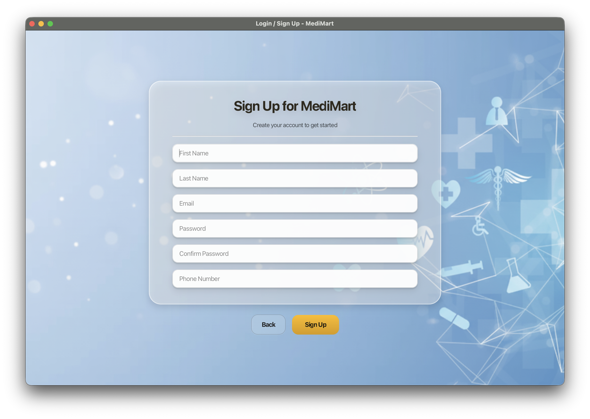
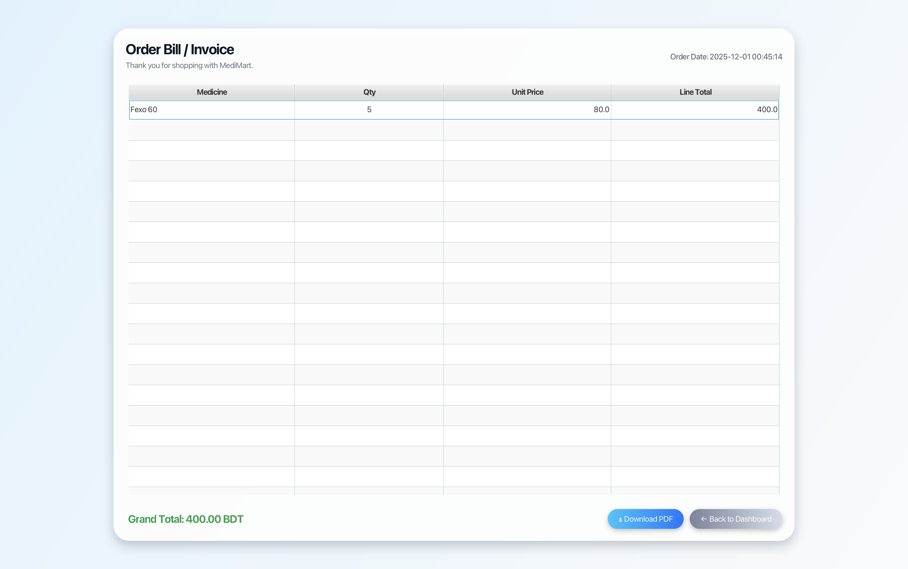

# 📘 MediMart – Medical Store Management System

MediMart is a **JavaFX-based desktop application** designed to modernize and automate pharmacy operations, including inventory management, customer shopping, order placement, billing, and authentication.  
The system is built with a clean **MVC architecture**, modular services, SQLite integration, and a polished JavaFX UI.

---
## 🏷️ Release

🔗 **Download MediMart Executable JAR**:  
[**MediMart.jar** - Version 1.0](https://github.com/Jahidul183019/MediMart/releases/download/v1.0/MediMart.jar)

> **MediMart** can be downloaded as a **JAR file**. You can run this directly on your desktop using the command below.

---

## 🔧 How to Run the Application (without IntelliJ IDEA)

1. **Download the JAR file** from the link above.

2. **Ensure you have Java 25 and JavaFX 25** installed. Download JavaFX SDK from [Gluon JavaFX SDK](https://gluonhq.com/products/javafx/).

3. **Run the JAR File in Terminal**:

 ### For macOS/Linux:
```bash
java \
--module-path /path/to/javafx-sdk-25.0.1/lib \
--add-modules javafx.controls,javafx.fxml \
-jar /path/to/MediMart.jar
   ```
  ### For Windows:
  ```bash
java ^
--module-path "C:\path\to\javafx-sdk-25.0.1\lib" ^
--add-modules javafx.controls,javafx.fxml ^
-jar "C:\path\to\MediMart.jar"

```

### Tested Command(macOS)
```bash
java \
--module-path /Users/md.jahidulislam/Downloads/javafx-sdk-25.0.1/lib \
--add-modules javafx.controls,javafx.fxml \
-jar /Users/md.jahidulislam/Desktop/MediMart.jar
```
  > Make sure to replace /path/to/javafx-sdk-25.0.1/lib with the actual path to your downloaded JavaFX SDK   folder
---


## 🌐 Web Version (Live)

🚀 **Live Web App:** https://medimart-frontend-coral.vercel.app/  

⚙️ **Frontend (React + Vite):** https://github.com/Jahidul183019/medimart-frontend  

🛠 **Backend (Spring Boot):** https://github.com/Jahidul183019/medimart-backend  

>  This repository contains the **JavaFX Desktop version** of MediMart.  
> The **web version** is implemented separately using **React + Spring Boot**.

---
## 🛠️ Tools & Technologies Used

| **Category**       | **Tools / Technologies** |
|--------------------|---------------------------|
| **Language**       | Java (JDK 17+) |
| **UI Framework**   | JavaFX, FXML |
| **Database**       | SQLite |
| **Architecture**   | MVC (Model–View–Controller) |
| **Styling**        | CSS (style.css, theme.css) |
| **Utilities**      | DBHelper, FileLogger, ConfigManager, Session, ImageStorage, ReportExporter |
| **Sync Engine**    | MedicineSync Server / Client |
| **Security**       | OTP Service, Prepared Statements, Session Management |
| **Build Tools**    | IntelliJ IDEA, JavaFX SDK |
| **Report Export**  | Apache PDFBox (for PDF generation) |

---

# 🗂️ Project Structure (Minimal)

Only package names shown (clean & compact):
```text
src/
├── models/        # Data models (Medicine, User, Order, Cart, Inventory, Payment, Bill…)
├── services/      # Business logic (MedicineService, OrderService, UserService, OTPService, Sync…)
├── ui/            # JavaFX controllers (Login, Dashboards, Cart, Bill, History, Profile,Entry point (Main.java, MainController.java)…)
├── utils/         # DBHelper, Logger, AppException, ConfigManager, Session, ImageStorage, ReportExporter…
├── resources/     # CSS, images, HTML pages, background assets,FXML for UI layouts
└── Database file  : medimart.db
```

---

# 🏛️ System Architecture (MVC)

### **Model Layer**
Represents data objects:  
`Medicine`, `User`, `Order`, `OrderItem`, `Inventory`, `Cart`, `Payment`, `Bill`

### **Service Layer**
Handles business logic:  
`MedicineService`, `OrderService`, `UserService`, `OTPService`, `MedicineSync`

### **UI / Controller Layer**
JavaFX controllers (screens & forms):  
`LoginPage`, `AdminDashboard`, `CustomerDashboard`, `CartView`, `BillView`, etc.

### **Utility Layer**
Reusable helpers:  
`DBHelper`, `FileLogger`, `ConfigManager`, `AppException`, `ImageStorage`, `Session`, `ReportExporter`

---

# 🚀 Key Features

### 🔐 Authentication & Security
- User/Admin login  
- Signup & OTP-based password reset  
- Secure session management  

### 🧑‍⚕️ Admin Module
- Add/Edit/Delete medicines  
- Update stock & expiry  
- View order history  
- Inventory monitoring  

### 🛍 Customer Module
- Browse/search medicines  
- Add to cart  
- Place orders  
- Card payment dialog  
- View order history  
- Update profile  

### 🛒 Cart & Billing
- Add/remove items  
- Auto total calculation  
- Card payment interface  
- Invoice PDF/CSV export  

### 🔄 Real-Time Sync Engine
- Real-time stock update  
- Sync between dashboards  
- Multi-threaded communication  

### 🛠 Utilities
- SQLite DB handling  
- Error logging  
- Exception abstraction  
- Image storage helper  
- Report exporting system

---
## 🖥️ Application Screenshots

### Home View
<p align="center">
  
</p>

### Admin Login
<p align="center">
  
</p>

### Admin Dashboard
<p align="center">
  
</p>

### Add Medicine Form
<p align="center">
  
</p>

### Customer Login
<p align="center">
  
</p>

### Signup Form
<p align="center">
  
</p>

### Customer Dashboard
<p align="center">
  
</p>

### Cart View
<p align="center">
  
</p>

### Card Payment View
<p align="center">
  
</p>

### Profile View
<p align="center">
  
</p>

### Order History
<p align="center">
  
</p>

### Invoice Preview
<p align="center">
  
</p>

📄 **Full Invoice PDF**  
[Download invoice.pdf](screenshots/invoice.pdf)

---

<h1>🖼️ UML Diagrams</h1>

<h3>📌 Class Diagram</h3>
<p align="center">
  
</p>

<h3>📌 Use Case Diagram</h3>
<p align="center">
  
</p>

<h3>📌 Sequence Diagram (Place Order)</h3>
<p align="center">
  
</p>

<h3>📌 Activity Diagram (Order Process Flow)</h3>
<p align="center">
  
</p>

# ⬇️ How to Clone

```bash
git clone https://github.com/Jahidul183019/MediMart.git
cd MediMart
```
# ⚙️ How to Run (IntelliJ IDEA + JavaFX)
### 1️⃣ Install Requirements

- JDK 17+
- JavaFX SDK 25
- IntelliJ IDEA Community Edition


### 2️⃣ Configure JavaFX

Add the JavaFX SDK lib folder to Project Structure → Libraries.

### 3️⃣ VM Options (Run Configuration)

Replace the path with your JavaFX SDK directory.

Windows:
```bash
--module-path "C:\javafx-sdk-25\lib" --add-modules javafx.controls,javafx.fxml,javafx.web  -Djava.library.path="/Users/md.jahidulislam/javafx-sdk-25.0.1/lib"  --enable-native-access=javafx.graphics,javafx.web,ALL-UNNAMED  -Dfile.encoding=UTF-8  -Dsun.stdout.encoding=UTF-8  -Dsun.stderr.encoding=UTF-8 
```
macOS/Linux:
```bash
--module-path "/Users/md.jahidulislam/javafx-sdk-25.0.1/lib"  --add-modules javafx.controls,javafx.fxml,javafx.web  -Djava.library.path="/Users/md.jahidulislam/javafx-sdk-25.0.1/lib"  --enable-native-access=javafx.graphics,javafx.web,ALL-UNNAMED  -Dfile.encoding=UTF-8  -Dsun.stdout.encoding=UTF-8  -Dsun.stderr.encoding=UTF-8 
```

Then run ui.Main.


# 🔐 Security Features

- OTP verification (Email/Phone)

- Session-based restriction

- SQL injection-safe prepared statements

- Admin route protection

# ✅ **Web version already implemented** using:
- React + Vite (Frontend)
- Spring Boot REST API (Backend)
- Cloud-based database
- WebSocket real-time sync
- Secure online payment gateway
- Admin analytics dashboard

# 🌱 Future Improvements:

- Live AI-powered medicine suggestion
- Prescription scanning
